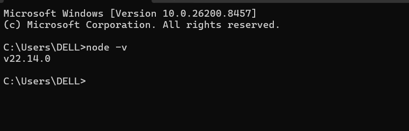
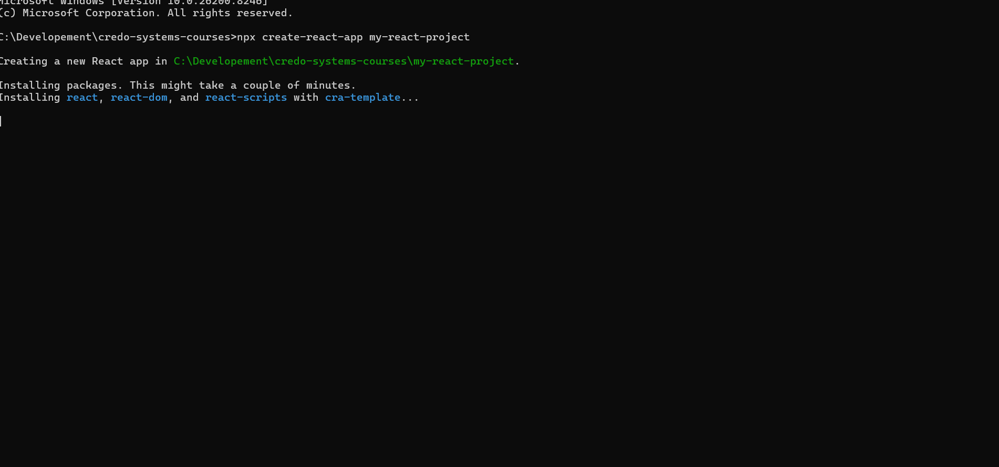
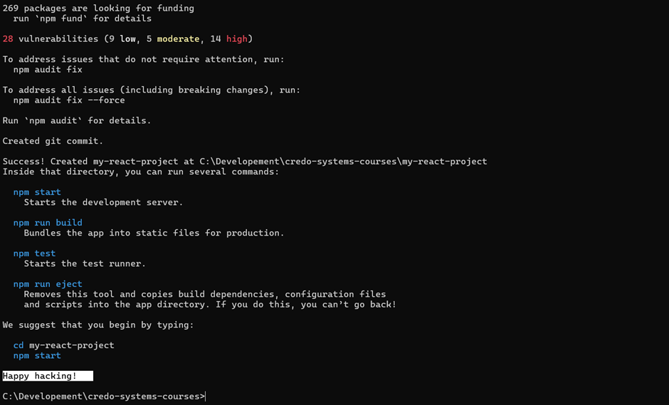
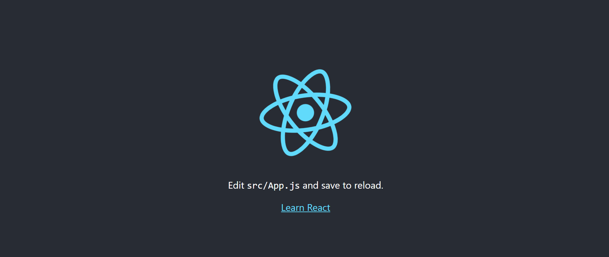

# ⚙️ Setting Up React
### 🟢 1. Install Node.js & npm

👉 First, install Node.js
(It automatically installs npm)

#### Steps:
- Go to: `https://nodejs.org`
- Download LTS version
- Install 

#### ✅ Check installation:

Open terminal / command prompt and type:
```
node -v
npm -v

👉 If versions show → ✅ Installed correctly
```


### 🟡 2. Create React App (Easy Way)


Option  (Older Method) → Use Create React App
```
npx create-react-app my-react-project
```




```
cd my-react-project
npm start
```


- 🧾 What happens after this?
- 👉 React app will open in browser
- 👉 You can start editing files in:

src/App.js

### 🎯 Simple Summary
- Install Node.js
- Create project using create-react-app
- Run project → start coding 🚀